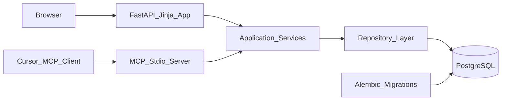

# Issue Tracker Project Plan

## Recommendation

Use a single Python service: FastAPI + Jinja templates + SQLAlchemy 2.x + Alembic + PostgreSQL + Python MCP SDK. Avoid a React/Next frontend for v1. Server-rendered pages with small progressive-enhancement JavaScript are enough for a personal issue tracker and remove an entire build/runtime surface.

Why this is the simplest reliable path:
- One language and one container for UI, API, auth, database access, and MCP logic.
- FastAPI has first-class container support and built-in OpenAPI docs for API verification.
- SQLAlchemy typed ORM plus Alembic migrations gives a durable PostgreSQL model without hand-written SQL drift.
- MCP can reuse the same service/repository layer as the web app, keeping behavior identical.
- Jinja pages are easier for GPT-5.5 to implement correctly on the first pass than a split React/API app.

## Source References Used

Use only these references for behavior and architecture assumptions:
- Project repo: `/Users/eli/github/issue-tracker`
- Functional tracker reference: `spacemanspiff99/vibecoding/projects/weather-app/cursor-rules/`
- Weather-app mirror provenance: source SHA `14ec98d23b9756fe9c2352a23f49d4f453bff60e`, mirrored at `2026-04-24T23:06:29Z`
- Official docs consulted for planned technologies: FastAPI Docker deployment, SQLAlchemy ORM 2.x, Alembic tutorial, MCP build-server/tools/resources specs

Do not read directly from `weather-app`, `investments`, or other project repos during implementation unless explicitly approved.

## Core Rule Compliance Review

This plan is compliant with `.cursor/rules/core.mdc` and is a good MVP plan if implementation stays inside the sprint boundaries below.

Required alignments already present:
- Uses one Python service with FastAPI, Jinja, SQLAlchemy 2.x, Alembic, PostgreSQL, and a stdio MCP server.
- Keeps implementation under `src/issue_tracker/`, migrations in the single central `migrations/` folder, docs under `documentation/`, and deployment assets under `deployment/`.
- Keeps the web app and MCP server thin by routing both through the same service layer.
- Treats categories as project-scoped data and uses this project's `IT-1` through `IT-6` taxonomy only as acceptance-criteria gates, not as global application constants.
- Avoids React, Next.js, duplicate migration folders, root-level implementation files, peer project taxonomy imports, plaintext secrets, and hidden production migrations.

Required implementation discipline:
- Each sprint issue must include acceptance criteria before implementation starts.
- Category-binding checklists from `documentation/standards/ISSUE_LOG.md` must be copied inline into sprint issues when the change touches that category.
- Schema work must land before dependent service, web, MCP, or deployment work.
- A sprint is not done until its validation commands pass or the blocker is recorded in the stop section.

## Product Scope

V1 should replace repo-local markdown issue tracking with a web UI and Postgres backend while preserving the workflow concepts from the weather-app rules:
- Projects with independent configuration.
- Sprints and sprint task prompts.
- Issues and sprints with shared project-local `NNNN` sequence IDs.
- Backlog, in-progress, and done lifecycle.
- Issue dependencies and blockers.
- Acceptance criteria required on every issue.
- Category-binding support so each project can define its own recurring bug taxonomy and required prevention checklist.
- Issue-log records for recurring bug patterns.
- Originating LLM tracking on close.
- Linked PRs and related/superseded issues.
- Low-token MCP tools for Cursor agents.

Out of scope for v1:
- Multi-user roles.
- Full GitHub issue synchronization.
- Importing every existing markdown tracker automatically.
- Complex drag-and-drop planning UI.
- Background schedulers beyond simple maintenance/health checks.

## Architecture

One codebase, two entrypoints:
- Web entrypoint: FastAPI app serving HTML and small JSON endpoints.
- MCP entrypoint: stdio MCP server exposing compact tools backed by the same service layer.

Deployment shape:
- Local development: compose starts app + local Postgres; Python dependencies, test tools, Alembic, and app commands run inside containers by default.
- Later deployment: compose starts only the app container and points at an external Postgres using environment variables.

## Proposed Repository Layout

Keep root minimal and conventional. Place implementation and deployment artifacts in folders:
- `src/issue_tracker/` for application code.
- `src/issue_tracker/web/` for FastAPI routes, templates, static files, auth/session handling.
- `src/issue_tracker/mcp/` for MCP stdio server and tool definitions.
- `src/issue_tracker/domain/` for models/enums/value objects.
- `src/issue_tracker/services/` for use cases like create issue, start sprint, close issue.
- `src/issue_tracker/repositories/` for SQLAlchemy persistence.
- `migrations/` as the single central Alembic migration folder.
- `tests/unit/` and `tests/integration/` for pytest coverage.
- `deployment/` for `Dockerfile`, compose files, entrypoint scripts, and deployment notes.
- `documentation/architecture/` for database schema and system overview.
- `documentation/guides/` for operating/import/MCP setup docs.
- `.cursor/rules/` for this project's own rules once implemented.

Root should only contain unavoidable project metadata such as `README.md`, `pyproject.toml`, `.gitignore`, and `.env.example`.

## Data Model

Core tables:
- `users`: one admin user for v1, password hash, timestamps.
- `projects`: project name, repo URL, default branch, tracker path hint, rules path hint, active flag.
- `project_settings`: per-project preferences such as issue prefix, default priority, default model, documentation path.
- `categories`: project-specific recurring issue categories, e.g. `CAT-1`, `CAT-6`, with description and canonical rule file/checklist text.
- `issues`: project ID, numeric sequence, title, slug, status, priority, labels, category ID, summary, proposed approach, acceptance criteria, originating LLM, created/closed timestamps.
- `issue_dependencies`: directed edges where one issue blocks or depends on another.
- `issue_events`: immutable lifecycle/history log.
- `sprints`: project ID, sequence, slug, goal, context, status, created/closed timestamps, next sprint pointer.
- `sprint_issues`: issue membership, phase, order, status.
- `sprint_tasks`: task prompt metadata, model, phase, file-style slug, status, parallel group, stop/handoff fields.
- `linked_prs`: provider, repo, PR number/URL, merge status.
- `issue_log_entries`: recurring bug log rows with root cause and prevention added.
- `app_settings`: install/setup parameters from environment or first-run setup.

Important constraints:
- Issue and sprint sequence numbers are unique per project, share one sequence counter, and display as four-digit zero-padded IDs such as `0001`.
- Issue filenames from the old markdown tracker become stable display/import metadata, not filesystem state.
- Dependencies must reject self-dependencies and cycles.
- Done issues keep immutable close metadata including originating LLM.

## Web UI

V1 pages:
- Login and first-run password setup.
- Project list and project detail dashboard.
- Backlog issue list with filters by status, priority, label, category, sprint, blocker state.
- Issue create/edit/detail pages with required acceptance criteria.
- Sprint create/detail/close pages with issue assignment and phase/task list.
- Dependency view per issue, showing blockers and blocked-by relationships.
- Category and checklist management per project.
- Issue log view for recurring bug patterns.
- Settings page for environment-derived values and project defaults.

Favor boring UI patterns:
- HTML forms first.
- Server-side validation with inline errors.
- Minimal JavaScript for confirm dialogs, dependency add/remove, and filter controls.
- No drag/drop in v1 unless everything else is stable.

## MCP Server Design

Use a stdio MCP server with compact tools. Do not expose verbose resources by default.

Token discipline:
- Tool outputs are short summaries by default.
- All list tools accept `limit`, `status`, and `project` filters.
- Full issue content is opt-in by ID.
- AC/checklist text is returned only when requested or required for creation.
- Tool names use ASCII letters, digits, underscores, hyphens, or dots only.
- Stdio logging writes to stderr only.

Initial tools:
- `project.list`: returns project IDs/names and active sprint IDs.
- `issue.create`: creates a backlog issue with AC and optional category checklist.
- `issue.get`: compact issue detail by ID or project sequence.
- `issue.search`: filtered compact issue list.
- `issue.update_status`: move backlog/in-progress/done with required close fields.
- `issue.add_dependency`: add blocker/dependency edge with cycle check.
- `sprint.create`: create sprint and shared sequence ID.
- `sprint.add_issue`: move backlog issue into sprint.
- `sprint.get`: compact sprint summary and next tasks.
- `category.list`: return project-specific categories and checklist names.
- `next_action`: return the smallest useful handoff for Cursor: current sprint, blocked issues, next task, and required model if configured.

Avoid MCP tools that dump all issues, all AC, or entire sprint documents unless a later version proves they are needed.

## Authentication And Security

Use single-user password login for v1:
- First-run setup creates the admin password if no user exists.
- Store password with Argon2 or bcrypt, never plaintext.
- Session cookie should be HTTP-only, SameSite=Lax, configurable secure flag.
- All secrets and setup parameters come from env vars or compose files.
- `.env` is never committed; provide `.env.example` only.
- Rate-limit login attempts lightly, even for personal use.

MCP access options:
- Local stdio MCP can rely on local process access for v1.
- If HTTP MCP is added later, require an explicit token and do not expose it publicly by default.

## Configuration And Docker

Environment variables:
- `DATABASE_URL`
- `APP_SECRET_KEY`
- `APP_BASE_URL`
- `ADMIN_USERNAME`
- `ADMIN_INITIAL_PASSWORD` or first-run setup mode
- `SESSION_COOKIE_SECURE`
- `MCP_ENABLED`
- `LOG_LEVEL`

Compose strategy:
- `deployment/docker-compose.local.yml`: app + local Postgres for development.
- `deployment/docker-compose.app.yml`: app only, external Postgres supplied by env/compose.
- `deployment/.env.example`: documented setup parameters without secrets.
- Host dependency rule: do not require host-level `pip install`, host virtualenv setup, host PostgreSQL, or host Alembic/test tooling for normal development. The host should need Docker/Compose, Git, and optional editor tooling only.

Container strategy:
- Build from official Python base image.
- Run a single FastAPI process per container initially.
- Run tests, linting, Alembic migrations, import/export checks, and MCP smoke tests through `docker compose run --rm app ...` or an equivalent documented container command.
- Run migrations as an explicit container command before app startup in local dev; for deployment, document the migration step clearly rather than hiding destructive changes.
- Health endpoint checks app and database connectivity.
- Mount source into the local development app container for quick iteration, but keep dependency caches, database volumes, logs, exports, and backups in ignored Docker volumes or ignored project folders.

## MVP Sprint Plan

These sprints are ordered so each one can be verified independently and handed to a fresh implementation chat. Each implementation prompt must load `core.mdc`, `agents.mdc`, `ac.mdc`, and the scoped rule files named in the sprint.

### Sprint Execution Standard

Each sprint must iterate to completion:
- Implement the smallest coherent slice.
- Run the listed containerized validation commands.
- If validation fails, inspect the failure, fix the cause, and rerun the relevant command.
- Repeat until every listed validation command passes, or until an external blocker prevents progress.
- Do not mark a sprint, risk issue, or implementation prompt complete with failing tests, skipped gates, or unverified behavior.
- If a blocker remains, record the exact command, failure output summary, suspected cause, owner action needed, and the next retry step in the STOP section.
- Keep testing evidence with the sprint closeout: command, pass/fail result, and any intentionally deferred coverage.

Subagent model policy:
- Use GPT-5.5 with `high` reasoning for delegated subtasks that touch architecture, schema and migrations, auth or secrets, deployment, MCP tool contracts, data integrity, difficult debugging, or release readiness.
- Use lighter subagent models only for narrow, mechanical, low-risk work with clear inputs, disjoint write scope, and simple verification.
- Each delegated subtask must name its model/reasoning choice, ownership scope, validation command, and handoff evidence.

### Risk-Burn-Down Issues

The first implementation pass must include explicit issues for the main risks below. Do not leave these as loose concerns or end-of-sprint notes; each owning sprint should create or track the issue before implementation starts, include the listed acceptance criteria, and close it only with evidence.

| Risk | Planned issue | Owning sprint | Required acceptance criteria |
|---|---|---|---|
| Source checkout and guidance mirror drift | Repository bootstrap and AI-guidance mirror readiness | Sprint 0001 | Work starts from a real Git checkout; `AGENTS.md` exists for Codex; `.github/workflows/mirror-rules.yml` mirrors Cursor rules, Cursor skills, Codex guidance, and Claude memory to `vibecoding`; missing `VIBECODING_MIRROR_TOKEN` or failed mirror runs are recorded as blockers with run URLs. |
| V1 scope creep | V1 scope lock and backlog triage | Sprint 0001 | The sprint issue lists in-scope and out-of-scope V1 behavior; no React/Next.js, GitHub sync, automatic full markdown migration, drag/drop planning, or multi-user roles are added; non-MVP requests are recorded as backlog instead of folded into active sprint work. |
| Host dependency pollution | Container-only development and verification issue | Sprint 0001 | Local setup uses Docker/Compose for app, PostgreSQL, tests, migrations, import/export checks, and MCP smoke tests; docs do not require host `pip install`, host virtualenvs, host PostgreSQL, or host Alembic. |
| Broad schema causing untested behavior | Schema invariant and migration safety issue | Sprint 0002 | Schema documentation, initial migration, repository tests, and service tests land before web or MCP wiring; tests cover shared sequence allocation, status transitions, dependency cycle rejection, category binding, and immutable close metadata. |
| Peer taxonomy leakage | Project-scoped category binding issue | Sprint 0002 and Sprint 0005 | Categories are stored as project data, not application constants; tests prove weather-app or other peer category names are not required by core logic; import requires explicit category mapping when source categories are present. |
| Hidden or unsafe migration behavior | Explicit migration runbook issue | Sprint 0001, Sprint 0002, and Sprint 0005 | Compose and deployment docs require explicit `alembic upgrade head`; app startup does not auto-drop, recreate, truncate, or silently migrate production databases; `/health` reports database connectivity after migrations are run. |
| MCP verbosity or web/MCP behavior drift | MCP contract and parity issue | Sprint 0004 | MCP tools call the same services as web routes; list outputs are bounded and compact by default; full issue content and acceptance criteria are opt-in by ID; tests assert output shape and stderr-only logging. |
| Final integration gaps | Fresh-checkout release rehearsal issue | Sprint 0006 | A fresh checkout can run documented setup, migrations, web smoke path, MCP smoke path, CI checks, and Docker health without relying on local-only files or secrets. |

### Sprint 0001: Project Foundation And Local Runtime

Goal: create the minimal repository structure, Python package, dependency config, local Postgres runtime, and secret-safe defaults needed for later tested work.

Rules to load: `core.mdc`, `agents.mdc`, `ac.mdc`, `devops.mdc`.

Scope:
- Add or verify Codex-native `AGENTS.md` and update the mirror workflow so `vibecoding` receives Cursor rules, Cursor skills, Codex guidance, and Claude memory as separate harness mirrors.
- Confirm implementation starts from a real Git checkout of `spacemanspiff99/issue-tracker`; if the local working directory is not a checkout, stop and record the exact recovery path before creating package files.
- Add `pyproject.toml`, package skeleton under `src/issue_tracker/`, `tests/`, `deployment/`, root `README.md`, `.env.example`, and a Python/Docker-safe `.gitignore`.
- Add local compose at `deployment/docker-compose.local.yml` with app and PostgreSQL services.
- Add app-only compose at `deployment/docker-compose.app.yml` for external PostgreSQL.
- Add a documented container command pattern for app startup, tests, migrations, and one-off management commands; host-level Python dependency installation is not part of the normal path.
- Add a minimal FastAPI app with `/health` returning app readiness; database connectivity can be marked pending until Sprint 0002 wires persistence.
- Create the V1 scope lock issue and record non-MVP requests as backlog instead of broadening the active sprint.

Acceptance criteria:
- [ ] Work is performed from a real Git checkout; if not, the sprint records the recovery command and stops before implementation.
- [ ] `AGENTS.md` exists and keeps Codex guidance out of Cursor `.mdc` files.
- [ ] `.github/workflows/mirror-rules.yml` mirrors `.cursor/rules/**`, `.cursor/skills/**`, `AGENTS.md`, nested `AGENTS*.md`, `.codex/rules/**`, and `CLAUDE.md` into the matching `vibecoding/projects/issue-tracker/` harness folders.
- [ ] If `VIBECODING_MIRROR_TOKEN` is missing or a mirror run fails, the issue records the blocker and GitHub Actions run URL.
- [ ] V1 scope lock issue explicitly excludes React/Next.js, full GitHub sync, automatic full markdown migration, drag/drop planning, and multi-user roles.
- [ ] Container-only development issue documents that normal setup requires Docker/Compose and does not require host `pip install`, a host virtualenv, host PostgreSQL, or host Alembic.
- [ ] Compose provides an app service usable for `pytest`, Alembic, import/export commands, and MCP smoke tests through `docker compose run --rm app ...`.
- [ ] Root contains only unavoidable metadata: `README.md`, `pyproject.toml`, `.gitignore`, and `.env.example`.
- [ ] Compose files live under `deployment/` and do not require `sudo`.
- [ ] `.env.example` contains placeholders only for `DATABASE_URL`, `APP_SECRET_KEY`, `APP_BASE_URL`, `ADMIN_USERNAME`, `SESSION_COOKIE_SECURE`, `MCP_ENABLED`, and `LOG_LEVEL`.
- [ ] No `.env`, passwords, tokens, logs, database dumps, backups, or generated artifacts are added.
- [ ] Containerized `python -m pytest tests/` runs through the app service, even if it only covers the health/app bootstrap path.

Category gates:
- `IT-6` Deployment And Configuration Drift: Verify compose files, env vars, health checks, explicit migrations, and workflow behavior stay aligned.
- `IT-5` Auth And Secret Safety: Verify password hashing, session flags, setup flow, secret handling, and no credential logging.

Validation commands:
- `docker compose -f deployment/docker-compose.local.yml run --rm app python -m pytest tests/`
- `docker compose -f deployment/docker-compose.local.yml config`

STOP:
- Stop only after the package imports, the minimal tests pass, compose config validates, and any missing database health behavior is recorded for Sprint 0002. If validation fails, iterate according to the Sprint Execution Standard before stopping.

### Sprint 0002: Schema, Migrations, Repositories, And Core Services

Goal: create the durable PostgreSQL schema and service-layer invariants before any UI or MCP wiring depends on them.

Rules to load: `core.mdc`, `agents.mdc`, `ac.mdc`, `backend.mdc`, `devops.mdc`.

Scope:
- Add SQLAlchemy 2.x models for users, projects, project settings, categories, issues, dependencies, events, sprints, sprint issues, sprint tasks, linked PRs, issue log entries, and app settings.
- Add the single central Alembic setup in `migrations/` and one reviewed initial migration.
- Add repositories for project, issue, sprint, category, dependency, and issue-log persistence.
- Add services for project-scoped sequence allocation, issue create/update/close, sprint create/close, dependency add/remove with cycle rejection, and category checklist lookup.
- Create and close the schema invariant issue before web or MCP work starts.
- Create and close the project-scoped category binding issue, including tests that prove peer taxonomies are not hardcoded.
- Create the explicit migration runbook issue and keep it open until the migration command is documented in Sprint 0005 if the guide does not exist yet.

Acceptance criteria:
- [ ] `docker compose -f deployment/docker-compose.local.yml run --rm app alembic upgrade head` succeeds against an empty PostgreSQL database.
- [ ] Database constraints reject duplicate project-local issue or sprint sequence IDs, self-dependencies, and invalid status values where PostgreSQL can enforce them safely.
- [ ] Service tests prove sequence allocation, issue status transitions, sprint lifecycle transitions, dependency cycle rejection, category binding, and immutable close metadata.
- [ ] Repositories are the only layer composing SQLAlchemy persistence queries.
- [ ] Web routes and MCP tools are not introduced in this sprint except for any existing health endpoint adjustments.
- [ ] Tests prove categories are project-scoped records and application logic does not require weather-app, investments, storyteller, or other peer category names.
- [ ] Initial migration is reviewed for accidental drops, type churn, and unrelated schema changes before it is accepted.

Category gates:
- `IT-1` Tracker State Integrity: Verify project-local sequence allocation, status transitions, dependency cycle rejection, and immutable close metadata.
- `IT-2` Category And AC Binding: Verify acceptance criteria are required, category checklists are inlined when applicable, and project taxonomies remain project-scoped data.
- `IT-3` Schema And Migration Safety: Verify SQLAlchemy models, PostgreSQL constraints, and Alembic migrations agree; run migration checks on an empty database.

Validation commands:
- `docker compose -f deployment/docker-compose.local.yml run --rm app python -m pytest tests/unit tests/integration`
- `docker compose -f deployment/docker-compose.local.yml run --rm app alembic upgrade head`

STOP:
- Stop only after schema, repositories, services, migrations, and tests pass; do not start web form or MCP tool wiring in the same prompt. If validation fails, iterate according to the Sprint Execution Standard before stopping.

### Sprint 0003: Authenticated Web MVP

Goal: provide the smallest server-rendered web flow that can manage projects, issues, dependencies, sprints, and close metadata through the service layer.

Rules to load: `core.mdc`, `agents.mdc`, `ac.mdc`, `backend.mdc`.

Scope:
- Add first-run admin setup, login, logout, session handling, and basic login rate limiting.
- Add Jinja templates and FastAPI routes for project list/detail, issue create/edit/detail/close, dependency add/remove, sprint create/detail/close, category list/edit, and issue log list.
- Keep route handlers thin: parse forms, call services, render templates, and translate domain errors into inline validation.
- Update `/health` to check database connectivity.

Acceptance criteria:
- [ ] First-run setup creates exactly one admin user with a hashed password and never logs the password.
- [ ] Session cookies are HTTP-only, SameSite=Lax, and use configurable secure flag behavior.
- [ ] Creating an issue without acceptance criteria returns an inline validation error and does not create an issue row.
- [ ] A user can create a project, create backlog issues, add a dependency, create a sprint, add issues to it, close an issue with originating LLM metadata, and view the issue-log page.
- [ ] Web route tests assert response content, state changes, and validation errors for success and failure paths.

Category gates:
- `IT-1` Tracker State Integrity: Verify project-local sequence allocation, status transitions, dependency cycle rejection, and immutable close metadata.
- `IT-2` Category And AC Binding: Verify acceptance criteria are required, category checklists are inlined when applicable, and project taxonomies remain project-scoped data.
- `IT-5` Auth And Secret Safety: Verify password hashing, session flags, setup flow, secret handling, and no credential logging.

Validation commands:
- `docker compose -f deployment/docker-compose.local.yml run --rm app python -m pytest tests/unit tests/integration`

STOP:
- Stop only after the tested web MVP supports the full issue-to-sprint-to-close path; leave import/export and MCP for later sprints. If validation fails, iterate according to the Sprint Execution Standard before stopping.

### Sprint 0004: MCP MVP

Goal: expose compact stdio MCP tools backed by the same services as the web app.

Rules to load: `core.mdc`, `agents.mdc`, `ac.mdc`, `backend.mdc`.

Scope:
- Add the MCP entrypoint under `src/issue_tracker/mcp/`.
- Implement `project.list`, `issue.create`, `issue.get`, `issue.search`, `issue.update_status`, `issue.add_dependency`, `sprint.create`, `sprint.add_issue`, `sprint.get`, `category.list`, and `next_action`.
- Add explicit input schemas, compact default outputs, filters/limits on list tools, and opt-in full detail by ID.
- Ensure stdio protocol messages are never polluted by logs on stdout.
- Create and close the MCP contract and parity issue before adding any extra MCP tools beyond the initial MVP list.

Acceptance criteria:
- [ ] MCP tools call the same service functions as the web routes for equivalent operations.
- [ ] List/search tools require or default to bounded limits and return compact summaries.
- [ ] Full issue content, acceptance criteria, and history are returned only when explicitly requested by ID.
- [ ] Mutating tools return structured IDs, status, and next-step hints without dumping full records.
- [ ] MCP startup smoke test passes and tests cover compact output shape plus validation errors.
- [ ] Tests fail if a list/search tool returns unbounded history, full acceptance criteria, or full issue bodies by default.

Category gates:
- `IT-1` Tracker State Integrity: Verify project-local sequence allocation, status transitions, dependency cycle rejection, and immutable close metadata.
- `IT-4` MCP Contract And Token Discipline: Verify tool schemas, compact default outputs, limit/filter parameters, opt-in detail, and stderr-only logging.

Validation commands:
- `docker compose -f deployment/docker-compose.local.yml run --rm app python -m pytest tests/unit tests/integration`
- MCP server startup smoke test command documented by the implementation prompt.

STOP:
- Stop only after tested MCP tools can create, search, get, update, and plan next action for issues without verbose default payloads. If validation fails, iterate according to the Sprint Execution Standard before stopping.

### Sprint 0005: Import, Export, Documentation, And Backup Safety

Goal: make the MVP operable and recoverable without widening product scope into full GitHub sync or automatic markdown migration.

Rules to load: `core.mdc`, `agents.mdc`, `ac.mdc`, `backend.mdc`, `devops.mdc`.

Scope:
- Add optional markdown import tooling for weather-app-style tracker shape using project-scoped category mapping, not hardcoded peer taxonomy.
- Add JSON export for projects, issues, sprints, dependencies, categories, issue logs, and linked PRs.
- Document local development, explicit migrations, external PostgreSQL deployment, MCP configuration, import/export, and backup/restore in `documentation/guides/`.
- Keep generated exports and backups in ignored folders.
- Close the explicit migration runbook issue if it remained open after Sprint 0002.

Acceptance criteria:
- [ ] Import requires an explicit target project and category mapping when source categories are present.
- [ ] Export writes valid JSON without secrets, session data, password hashes, or environment values.
- [ ] Import/export tests cover a minimal project with issues, acceptance criteria, dependency edges, sprint membership, categories, and linked PR metadata.
- [ ] Guides include exact local startup, migration, MCP setup, and backup/restore commands.
- [ ] Guides show containerized commands for tests, migrations, import/export, and MCP smoke checks; they do not instruct users to install Python dependencies directly on the host.
- [ ] Generated export and backup paths are ignored by git.
- [ ] Migration docs make clear that production or external PostgreSQL migrations are explicit commands, not hidden startup side effects.

Category gates:
- `IT-2` Category And AC Binding: Verify acceptance criteria are required, category checklists are inlined when applicable, and project taxonomies remain project-scoped data.
- `IT-3` Schema And Migration Safety: Verify SQLAlchemy models, PostgreSQL constraints, and Alembic migrations agree; run migration checks on an empty database.
- `IT-6` Deployment And Configuration Drift: Verify compose files, env vars, health checks, explicit migrations, and workflow behavior stay aligned.

Validation commands:
- `docker compose -f deployment/docker-compose.local.yml run --rm app python -m pytest tests/unit tests/integration`
- `docker compose -f deployment/docker-compose.local.yml run --rm app alembic upgrade head`

STOP:
- Stop only after backup/import/export behavior is documented and tested; do not add full GitHub synchronization. If validation fails, iterate according to the Sprint Execution Standard before stopping.

### Sprint 0006: MVP Hardening And Release Gate

Goal: verify the end-to-end MVP from fresh checkout through Docker health, web workflow, MCP workflow, and CI checks.

Rules to load: `core.mdc`, `agents.mdc`, `ac.mdc`, `backend.mdc`, `devops.mdc`.

Scope:
- Add GitHub Actions for lint/test and Docker build if not already present.
- Add startup diagnostics and final health behavior for app plus database.
- Add browser or route-level smoke coverage only where simple route tests no longer prove the user-facing flow.
- Review docs, `.gitignore`, generated artifacts, and secret safety before tagging the MVP as ready.
- Create and close the fresh-checkout release rehearsal issue before marking MVP ready.

Acceptance criteria:
- [ ] Fresh clone setup docs can start local PostgreSQL and the app with documented commands.
- [ ] Containerized `alembic upgrade head` applies cleanly to an empty PostgreSQL database.
- [ ] Docker local stack reaches `/health` and verifies database connectivity.
- [ ] Admin can complete the web MVP path: setup/login, project, issue, dependency, sprint, close, issue log.
- [ ] MCP can complete the MVP agent path: project list, issue create/search/get/update, dependency add, sprint create/add/get, next action.
- [ ] CI runs lint/tests and a Docker build without committing secrets or large generated files.
- [ ] Release rehearsal starts from a clean checkout and does not depend on local-only `.env`, caches, database dumps, generated exports, or uncommitted files.
- [ ] Release rehearsal does not require host Python package installation, host virtualenv activation, or host PostgreSQL.

Category gates:
- `IT-1` Tracker State Integrity: Verify project-local sequence allocation, status transitions, dependency cycle rejection, and immutable close metadata.
- `IT-4` MCP Contract And Token Discipline: Verify tool schemas, compact default outputs, limit/filter parameters, opt-in detail, and stderr-only logging.
- `IT-5` Auth And Secret Safety: Verify password hashing, session flags, setup flow, secret handling, and no credential logging.
- `IT-6` Deployment And Configuration Drift: Verify compose files, env vars, health checks, explicit migrations, and workflow behavior stay aligned.

Validation commands:
- `docker compose -f deployment/docker-compose.local.yml run --rm app python -m pytest tests/`
- `docker compose -f deployment/docker-compose.local.yml run --rm app alembic upgrade head`
- `docker compose -f deployment/docker-compose.local.yml up --build`
- `docker compose -f deployment/docker-compose.local.yml run --rm app python -c "import yaml; yaml.safe_load(open('.github/workflows/mirror-rules.yml'))"` if workflows changed

STOP:
- Stop only after all MVP gates pass and record any remaining non-MVP backlog items instead of expanding this release. If validation fails, iterate according to the Sprint Execution Standard before stopping.

## Testing Plan

Use risk-scaled tests:
- Unit tests for sequence allocation, status transitions, dependency cycle detection, category checklist requirements, and slug generation.
- Integration tests with PostgreSQL for migrations and repository queries.
- Web route tests for login, issue create/edit/close, sprint create/close, and dependency add/remove.
- MCP tests for compact output shape and no accidental huge payloads.
- Docker smoke test for local compose boot and health endpoint.
- Run tests and migration checks inside the app container by default to avoid host dependency drift.
- Treat a failing test or smoke check as part of the sprint work. Fix the implementation, test, fixture, or documented command, then rerun until the gate passes.
- Do not skip integration, migration, MCP, or Docker checks because they are inconvenient. Skip only for a real external blocker, and record the exact blocker and next retry step.

Acceptance gates for v1:
- Fresh clone can start local Postgres and app using documented compose command.
- Admin can log in, create a project, create issues, add dependencies, create a sprint, move issues through done, and view issue log entries.
- MCP can create/search/get/update issues without returning verbose payloads by default.
- No secrets are committed.
- Migrations apply cleanly to an empty database from inside the app container.

## Concerns And Recommendations

Main concern: scope creep. A full Jira/Linear clone will slow this down. Keep v1 focused on your local markdown tracker workflow plus the MCP path.

Second concern: importing project-specific taxonomies incorrectly. The schema must treat categories as project data, not global constants. Weather-app `CAT-1` through `CAT-6` should be an example only, not hardcoded.

Third concern: hiding migration behavior in container startup. For personal use it is tempting, but explicit migration commands are safer once the app points at an external Postgres.

Recommendation: build the service layer first and keep both UI and MCP thin. That gives the best chance that GPT-5.5 gets the core behavior right once, and it prevents the web UI and MCP server from drifting.
